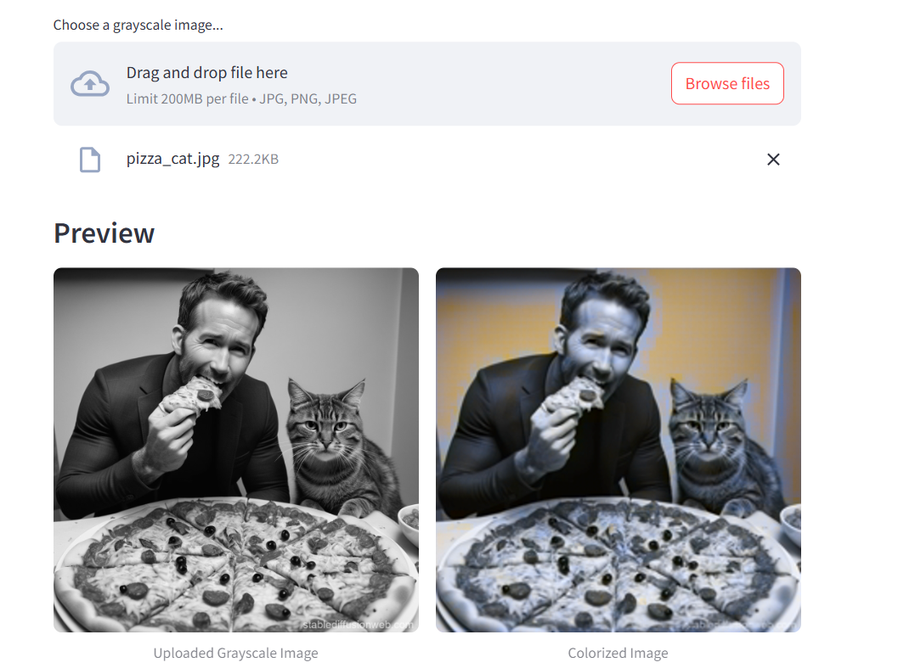

# Automatic Image Colorization App

This project is a **Streamlit web application** for automatic colorization of grayscale images using a deep learning model. The app allows users to upload a grayscale image and view its colorized version side-by-side, leveraging a PyTorch-based neural network.

---

## 🚀 Features

- Upload grayscale images (`.jpg`, `.jpeg`, `.png`)
- View original and colorized images side-by-side
- Simple, responsive UI built with Streamlit
- Modular code structure for easy extension

---

## 🏗️ Folder Structure

```
image_colorization_app/
│
├── app/
│   ├── __init__.py
│   ├── streamlit_app.py         # Main Streamlit UI
│   ├── inference.py             # Model loading & inference logic
│   └── model/
│       ├── __init__.py
│       ├── colorization_model.py # Model architecture (PyTorch)
│       └── colorization_model.pth # Trained model weights
│
├── requirements.txt             # Python dependencies
└── README.md                    # Project documentation
```

---

## 🧠 Model Overview

The colorization model is a convolutional neural network (CNN) inspired by the [“Colorful Image Colorization”](https://arxiv.org/abs/1603.08511) paper. It takes a single-channel (L) grayscale image and predicts the two color channels (a, b) in the LAB color space.

### Model Architecture Diagram

```mermaid
graph TD
    A[Input Grayscale Image (L)] --> B[Preprocessing]
    B --> C[ColorizationNet (CNN)]
    C --> D[Output ab Channels]
    D --> E[Postprocessing & Merge with L]
    E --> F[Colorized RGB Image]
```

---

## 🏋️ Model Training (Summary)

1. **Dataset:**  
   Use a dataset like [ImageNet](http://www.image-net.org/) or [COCO](https://cocodataset.org/) with color images.

2. **Preprocessing:**  
   - Convert images to LAB color space.
   - Use the L channel as input, ab channels as targets.

3. **Training Loop:**  
   - Model: Custom CNN (`ColorizationNet`)
   - Loss: MSE or cross-entropy on ab channels
   - Optimizer: Adam or SGD

4. **Saving Weights:**  
   - Save the trained model as `colorization_model.pth` in `app/model/`.

> **Note:** The provided app expects a pre-trained model. Training code is not included but can be added if needed.

---

## 🖥️ Streamlit App Flow



---

## 🛠️ How to Run Locally

1. **Clone the repository:**
   ```sh
   git clone https://github.com/yourusername/image_colorization_app.git
   cd image_colorization_app
   ```

2. **Install dependencies:**
   ```sh
   pip install -r requirements.txt
   ```

3. **Ensure model weights are present:**
   - Place `colorization_model.pth` in `app/model/`.

4. **Run the Streamlit app:**
   ```sh
   streamlit run app/streamlit_app.py
   ```

5. **Open your browser:**  
   Visit [http://localhost:8501](http://localhost:8501)

---

## ☁️ Deploying to Streamlit Cloud

1. Push your repository to GitHub.
2. Go to [Streamlit Cloud](https://streamlit.io/cloud) and connect your repo.
3. Set the main file path to `app/streamlit_app.py`.
4. Make sure `requirements.txt` is present.
5. Add `colorization_model.pth` to your repo or use a download script in `app/model/`.
6. Deploy!

---

## 📄 Requirements

- Python 3.8+
- streamlit
- torch
- torchvision
- pillow
- numpy

(See `requirements.txt` for full list.)

---

## 📢 Credits

- Model architecture inspired by [Zhang et al., 2016](https://arxiv.org/abs/1603.08511)
- Built with [Streamlit](https://streamlit.io/) and [PyTorch](https://pytorch.org/)

---

## 🤝 Contributing

Feel free to open issues or pull requests for improvements!

---

## 📷 Example

| Grayscale Input | Colorized Output |
|-----------------|-----------------|
|  |  |

---

**Showcase your work and enjoy automatic image colorization!**